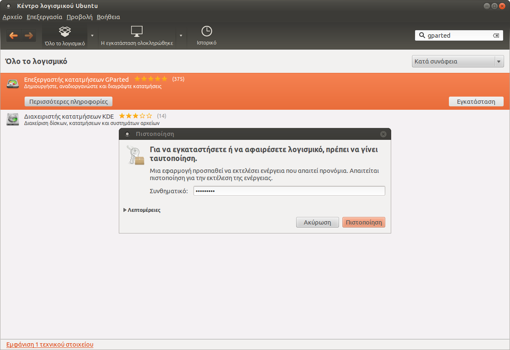
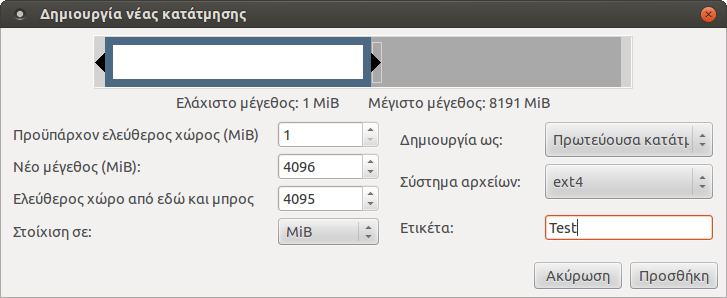

# Gparted

Η εφαρμογή `gparted` επιτρέπει τη διαχείριση των κατατμήσεων των δίσκων μέσα
από ένα εύχρηστο γραφικό περιβάλλον.

Πιο συγκεκριμένα υποστηρίζονται οι ακόλουθες ενέργειες:

  - Αλλαγή μεγέθους, αντιγραφή και μετακίνηση των κατατμήσεων
  - Δυνατότητα μεγέθυνσης ή σμίκρυνσης μίας κατάτμησης (π.χ. του C: drive)
  - Δημιουργία ελεύθερου χώρου στο δίσκο ώστε να εγκατασταθεί ένα νέο
    λειτουργικό σύστημα
  - Διαγραφή, έλεγχος μιας κατάτμησης
  - Ορισμός νέου UUID ή νέας ετικέτας σε μία κατάτμηση
  - Προσπάθεια για ανάκτηση δεδομένων (data rescue) από κατατμήσεις που
    παρουσιάζουν πρόβλημα

Υποστηρίζονται όλα τα γνωστά συστήματα αρχείων όπως btrfs, ext2 / ext3 / ext4,
fat16 / fat32, hfs / hfs+, linux-swap, lvm2 pv, nilfs2, ntfs, reiserfs /
reiser4, ufs, xfs

## Εγκατάσταση GParted

{: .right33}
Μπορείτε να εγκαταστήσετε το `gparted` από το [synaptic](synaptic.md) ή με την
παρακάτω εντολή σε ένα τερματικό:

```shell
sudo apt-get install gparted
```

Στην συνέχεια, μπορείτε να εκκινήσετε την εφαρμογή είτε από το μενού
==Εφαρμογές== ▸ ==Εργαλεία συστήματος== ▸ ==GParted==, είτε με την εντολή:

```shell
sudo gparted
```

!!! tip
    Η εφαρμογή απαιτεί δικαιώματα διαχειριστή (sudo) για να εκτελεστεί.

## Γενικά

{: .right33}
Κατά την εκκίνηση, η εφαρμογή σαρώνει το
υπολογιστή για την ανίχνευση όλων των σκληρών δίσκων. Στην εικόνα
δεξιά σας φαίνεται η αρχική οθόνη της εφαρμογής. Ο δίσκος που
εμφανίζεται είναι αυτός που περιέχει το λειτουργικό σύστημα. Η
γραφική διεπαφή της εφαρμογής αποτελείται από:

  - την μπάρα μενού η όποια περιέχει όλες τις λειτουργίες που θα
    χρειαστεί να εκτελέσετε για την διαχείριση των συσκευών σας.
  - την εργαλειοθήκη η οποία περιέχει ένα υποσύνολο των συχνότερων
    λειτουργιών, τα όποια βέβαια μπορείτε να χρησιμοποιήσετε και
    από το μενού,
  - την γραφική απεικόνιση των κατατμήσεων του επιλεγμένου
    δίσκου,
  - την λίστα κειμένου η οποία περιέχει τις πληροφορίες για τις
    κατατμήσεις του επιλεγμένου δίσκου,
  - και την μπάρα κατάστασης η οποία εμφανίζει είτε την τρέχουσα
    κατάσταση του Gparted είτε την ουρά των διεργασιών που έχει
    να εκτελέσει.

Κάνοντας αριστερό κλικ σε οποιοδήποτε κατάτμηση πάνω στην γραφική
απεικόνιση μπορείτε να επιλέξετε εκείνη την κατάτμηση που θέλετε
να επεξεργαστείτε, ενώ κάνοντας δεξί κλικ εμφανίζεται ένα μενού
επιλογών με τις συχνότερες ενέργειες για την διαχείριση τους.

## Δημιουργία κατατμήσεων σε νέο δίσκο

Για την δημιουργία κατατμήσεων σε ένα καινούριο δίσκο θα πρέπει να
ακολουθήσετε τα παρακάτω βήματα:

1.  [Επιλογή της επιθυμητής συσκευής](#επιλέγοντας-μια-συσκευή)
2.  [Δημιουργία πίνακα κατατμήσεων στην
    συσκευή αυτή](#δημιουργία-νέου-πίνακα-κατατμήσεων)
3.  [Δημιουργία κατατμήσεων](#δημιουργία-νέας-κατάτμησης)

### Επιλέγοντας μια συσκευή

Για να επιλέξετε ένα δίσκο, πηγαίνετε στο μενού ==GParted== ▸ ==Συσκευές== και
διαλέξτε την συσκευή από την λίστα. Εναλλακτικά μπορείτε να επιλέξετε την
συσκευή από το combobox που βρίσκεται στα δεξιά της εργαλειοθήκης.

!!! tip "Συμβουλή"
    Στην περίπτωση, που δεν βλέπετε την συσκευή στην λίστα, μπορείτε να κάνετε
    ανανέωση των συσκευών από το μενού ==Gparted== ▸ ==Ανανέωση συσκευών==.

### Δημιουργία νέου πίνακα κατατμήσεων

!!! warning "Προσοχή"
    Αυτή η ενέργεια χρειάζεται μόνο για καινούριους σκληρούς δίσκους που δεν
    έχουν ακόμα λειτουργικό σύστημα και διαγράφει όλα τα δεδομένα από τον
    δίσκο.

Για να δημιουργήσετε έναν πίνακα κατατμήσεων σε ένα δίσκο:

  - Επιλέγετε την [επιθυμητή συσκευή](#επιλέγοντας-μια-συσκευή).
  - Επιλέγετε το μενού ==Συσκευές== ▸ ==Δημιουργία πίνακα κατατμήσεων==. Η
    εφαρμογή εμφανίζει έναν διάλογο με τίτλο ==Νέος πίνακας κατατμήσεων στο
    /path-to-device==.
  - Στην περίπτωση που θέλετε να δημιουργήσετε διαφορετικού τύπου πίνακα
    κατατμήσεων από το ==msdos== , κάνετε κλικ στην επιλογή ==Για
    προχωρημένους== και επιλέγετε τον τύπο που επιθυμείτε από την λίστα που σας
    εμφανίζεται.

### Δημιουργία νέας κατάτμησης

Για να δημιουργήσετε μια νέα κατάτμηση σε έναν νέο δίσκο

  - Επιλέγετε την περιοχή που αναγράφει ==αδιάθετα==, από την γραφική απεικόνιση της
    συσκευής.
  - Κάνετε κλικ στο εικονίδιο
    .
    {: .right33}
    Η εφαρμογή εμφανίζει έναν διάλογο με τίτλο ==Δημιουργία νέας κατάτμησης==.

    !!! tip "Συμβουλή"
        Εναλλακτικά, μπορείτε να εμφανίσετε τον διάλογο αυτό, κάνοντας ==δεξί
        κλικ== στην περιοχή που αναγράφει ==αδιάθετα==, από την γραφική
        απεικόνιση της συσκευής και επιλέγοντας το ==Νέα== από το αναδυόμενο
        μενού που εμφανίζεται.

  - Ορίζετε το μέγεθος και την τοποθεσία της κατάτμησης.

    !!! tip "Συμβουλή"
        Την ενέργεια αυτή μπορείτε να την υλοποιήσετε είτε συμπληρώνοντας τα
        πεδία ==Νέο μέγεθος (MiB)== και ==Ελεύθερος χώρος από εδώ και μπρος==,
        είτε μετατοπίζοντας τα βελάκια αριστερά και δεξιά στην γραφική
        αναπαράσταση της συσκευής που εμφανίζεται στον διάλογο.

  - Ορίζετε την στοίχιση της κατάτμησης.{: .right33}
  - Ορίζετε τον τύπο της κατάτμησης.
  - Ορίζετε τον σύστημα αρχείων της κατάτμησης
  - Ορίζετε την ετικέτα για την κατάτμηση αυτή
  - Τέλος επιλέγετε ==Προσθήκη== και κάνετε κλικ στο εικονίδιο
    
    για να εφαρμοστούν οι αλλαγές.

## Αλλαγή μεγέθους μια κατάτμησης στο δίσκο

Στην ενότητα αυτή περιγράφονται ενέργειες όπως:

  - [Μείωση του μεγέθους μιας κατάτμησης σε ένα δίσκο (shrink) με σκοπό την
    παραγωγή ελεύθερου χώρου](#δημιουργία-ελεύθερου-χώρου-στο-δίσκο),
  - [Αύξηση του μεγέθους μιας
    κατάτμησης](#αύξηση-του-μεγέθους-μιας-κατάτμησης).

### Δημιουργία ελεύθερου χώρου στο δίσκο

Για να δημιουργήσετε ελεύθερο χώρο στον δίσκο θα πρέπει να μειώσετε (shrink) το
μέγεθος μιας κατάτμησης. Για να μειώσετε το μέγεθος:

  - {: .right33}Επιλέξτε
    την κατάτμηση την που επιθυμείτε.
  - Επιλέξτε το μενού ==Κατάτμηση== ▸ ==Αλλαγή μεγέθους/μετακίνηση==. Η
    εφαρμογή εμφανίζει έναν διάλογο με τίτλο ==Αλλαγή μεγέθους / μετακίνηση
    /path/to/partition==.
  - Ρυθμίστε το μέγεθος και την τοποθεσία της κατάτμησης.
  - Ρυθμίστε την στοίχιση της κατάτμησης.
  - {: .right33}
    Τέλος, επιλέξτε ==Αλλαγή μεγέθους/ Μετακίνηση== και κάντε κλικ στο
    εικονίδιο
     για να
    εφαρμοστούν οι αλλαγές.

    !!! warning "Προσοχή"

        Για την αποφύγετε τυχόν δυσάρεστα αποτελέσματα κατά την μείωση NTFS
        κατατμήσεων, προτείνεται μέσα από το Λ/Σ MS-Windows:

        - Να ανασυγκροτήσετε το σύστημα αρχείων της κατάτμησης αυτής
        - Να πραγματοποιήσετε έλεγχο λαθών με την εντολή:

        ```shell
        C:> chkdsk /f /r
        ```

        - Εάν δεν διαθέτει το σύστημά σας αρκετό ελεύθερο χώρο στο δίσκο μπορείτε να
          απενεργοποιήσετε το "paging file" ή και να μετακινήσετε μεγάλα αρχεία (όχι του Λ/Σ)
          σε άλλη κατάτμηση ή σε άλλο δίσκο
        - Να βεβαιωθείτε ότι το σύστημα έχει κλείσει σωστά
        - Να αφήσετε τουλάχιστον 10% αχρησιμοποίητο χώρο στην NTFS κατάτμηση
        - Να επανεκκίνηστε δύο φορές το λειτουργικό σύστημα της κατάτμησης
          αυτής μετά την ολοκλήρωση της ενέργειας.

Στην συνέχεια, στον ελεύθερο χώρο που έχει δημιουργηθεί (στην εικόνα πάνω
δεξιά σας φαίνεται ως ==αδιάθετα 2,12GiB==) πρέπει να ακολουθήσετε την διαδικασία που
περιγράφεται στην ενότητα [Δημιουργία κατατμήσεων σε νέο δίσκο](#δημιουργία-κατατμήσεων-σε-νέο-δίσκο)
για να μπορέσει να το δει το λειτουργικό σύστημα ή αλλιώς μπορείτε να
επιλέξετε αυτήν την "κενή" κατάτμηση για να εγκαταστήσετε το Ubuntu.

### Αύξηση του μεγέθους μιας κατάτμησης

Η διαδικασία της αύξησης του μεγέθους μιας κατάτμησης είναι παρόμοια με αυτή
που περιγράφτηκε παραπάνω, αυτής της μείωσης του μεγέθους, στην ενότητα
[Δημιουργία ελεύθερου χώρου στο δίσκο](#δημιουργία-ελεύθερου-χώρου-στο-δίσκο).
Κάποια σημεία που χρίζουν προσοχής είναι:

- Για να αυξήσετε το μέγεθος μιας κατάτμησης θα πρέπει να υπάρχει ελεύθερος
  χώρος δίπλα στην κατάτμηση.
- Στην περίπτωση που πρόκειται για λογική κατάτμηση, τότε ο ελεύθερος χώρος
  πρέπει να είναι εντός του εκτεταμένου κατάτμησης.
- Στην περίπτωση που πρόκειται για κύρια κατάτμηση, τότε ο ελεύθερος χώρος
  πρέπει να μην είναι εντός του εκτεταμένου κατάτμησης.
- Μπορείτε να μεταφέρετε τον ελεύθερο χώρο εντός ή εκτός του εκτεταμένου
  κατάτμησης με την αλλαγή του μεγέθους των ορίων του κατάτμησης αυτού.

!!! warning "Προσοχή"

    Εάν η λειτουργία που προσπαθήσετε να εκτέλεσε περιλαμβάνει μετακίνηση
    μιας κατάτμησης θα πρέπει να γνωρίζετε ότι:

    - οι μεταφορές των κατατμήσεων διαρκούν πάρα πολύ χρόνο,
    - και εάν η κατάτμηση περιέχει τα boot αρχεία ενός λειτουργικού συστήματος,
      τότε η μετακίνηση της συγκεκριμένης κατάτμησης μπορεί να προκαλέσει την
      αδυναμία εκκίνησης του λειτουργικού συστήματος.
