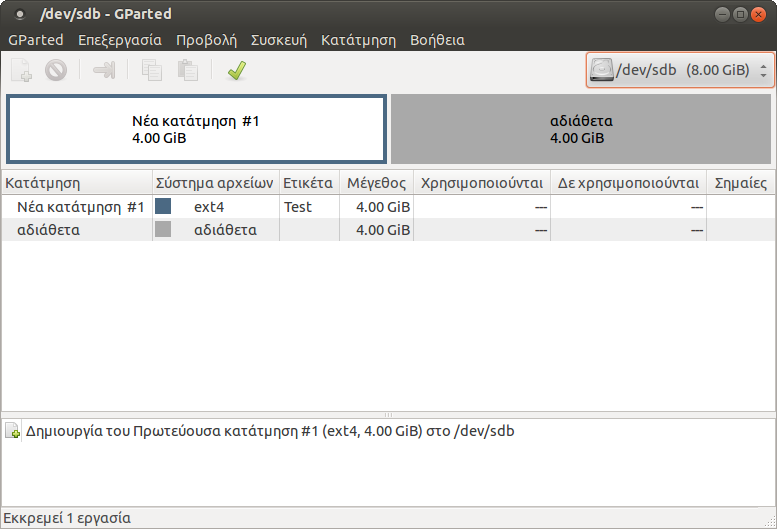
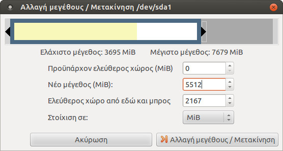

Ο ++"ΕΠΕΞΕΡΓΑΣΤΗΣ ΚΑΤΑΤΜΉΣΕΩΝ GPARTED"++ είναι μία εφαρμογή που προσφέρει γραφικό περιβάλλον για τη διαχείριση των διαμερίσεων των δίσκων και είναι διαθέσιμη από το
[liveusb](../liveusb.md) του Ubuntu.

Πιο συγκεκριμένα υποστηρίζονται οι ακόλουθες ενέργειες:

  - Αλλαγή μεγέθους, αντιγραφή και μετακίνηση των διαμερίσεων
  - Δυνατότητα μεγέθυνσης ή σμίκρυνσης μίας διαμέρισης (πχ του C: drive)
  - Δημιουργία ελεύθερου χώρου στο δίσκο ώστε να εγκατασταθεί ένα νέο
    λειτουργικό σύστημα
  - Διαγραφή, έλεγχος μιας διαμέρισης
  - Ορισμός νέου UUID σε μία διαμέριση
  - Προσπάθεια για ανάκτηση δεδομένων (data rescue) από διαμερίσεις που
    παρουσιάζουν πρόβλημα

Υποστηρίζονται όλα τα γνωστά Filesystems όπως:

  - btrfs, ext2 / ext3 / ext4, fat16 / fat32, hfs / hfs+, linux-swap, lvm2 pv,
    nilfs2, ntfs, reiserfs / reiser4, ufs, xfs

## Εγκατάσταση Gparted

{: .right33}
Στο [LiveCD](../liveusb.md) που προσφέρει η Τεχνική Στήριξη είναι
ήδη εγκατεστημένη η εφαρμογή ++"ΕΠΕΞΕΡΓΑΣΤΗΣ ΚΑΤΑΤΜΉΣΕΩΝ GPARTED"++ 
και μπορείτε να την χρησιμοποιήσετε πριν την εγκατάσταση του λειτουργικού συστήματος Ubuntu για την διαμόρφωση του δίσκου σας.

!!! tip "Συμβουλή"
    Για να εκκινήσετε το [LiveCD](../liveusb.md) πατήστε το ++"Space"++ κατά την εκκίνηση του υπολογιστή σας.

Στην περίπτωση που δεν χρησιμοποιήσετε το LiveCD της Τεχνικής Στήριξης,
μπορείτε να εγκαταστήσετε τον ++"ΕΠΕΞΕΡΓΑΣΤΗΣ ΚΑΤΑΤΜΉΣΕΩΝ GPARTED"++ από
το ++"ΚΕΝΤΡΟ ΛΟΓΙΣΜΙΚΟΥ UBUNTU"++ , κάνοντας αναζήτηση την λέξη
`gparted`. Διαφορετικά, μπορείτε να εγκαταστήσετε την εφαρμογή μέσω του
τερματικού πληκτρολογώντας την εντολή:

```shell
sudo apt-get install gparted
```

Στην συνέχεια, μπορείτε να εκκινήσετε την εφαρμογή είτε από το Gnome
μενού πηγαίνοντας στην επιλογή
++"Εφαρμογές"++▸++"Διαχείριση συστήματος"++▸++"Επεξεργαστής κατατμήσεων Gparted"++,
είτε εκτελώντας την εντολή:

```shell
sudo gparted
```
!!! tip "Συμβουλή"
    Η εφαρμογή απαιτεί δικαιώματα διαχειριστή (sudo) για να εκτελεστεί.

## Γενικά

{: .right33}
Κατά την εκκίνηση, η εφαρμογή σκάναρει το
υπολογιστή για την ανίχνευση όλων των σκληρών δίσκων. Στην εικόνα
δεξιά σας φαίνεται η αρχική οθόνη της εφαρμογής. Ο δίσκος που
εμφανίζεται είναι αυτός που περιέχει το λειτουργικό σύστημα. Η
γραφική διεπαφή της εφαρμογής αποτελείται από:

  - την μπάρα μενού η όποια περιέχει όλες τις λειτουργίες που θα
    χρειαστεί να εκτελέσετε για την διαχείριση των συσκευών σας.
  - την εργαλειοθήκη η οποία περιέχει ένα υποσύνολο των συχνότερων
    λειτουργιών, τα όποια βέβαια μπορείτε να χρησιμοποιήσετε και
    από το μενού,
  - την γραφική απεικόνιση των κατατμήσεων(διαμερίσεων) του επιλεγμένου
    δίσκου,
  - την λίστα κειμένου η οποία περιέχει τις πληροφορίες για τις
    κατατμήσεις(διαμερίσεις) του επιλεγμένου δίσκου,
  - και την μπάρα κατάστασης η οποία εμφανίζει είτε την τρέχουσα
    κατάσταση του Gparted είτε την ουρά των διεργασιών που έχει
    να εκτελέσει.

Κάνοντας ++"αριστερό κλικ"++ σε οποιοδήποτε διαμέριση πάνω στην γραφική
απεικόνιση μπορείτε να επιλέξετε εκείνη την διαμέριση που θέλετε
να επεξεργαστείτε, ενώ κάνοντας ++"δεξί κλικ"++ σας εμφανίζεται ένα μενού
επιλογών με τις συχνότερες ενέργειες για την διαχείριση τους.

## Δημιουργία διαμερίσεων σε νέο δίσκο

Για την δημιουργία διαμερίσεων σε ένα καινούριο δίσκο θα πρέπει να
ακολουθήσετε τα παρακάτω βήματα:

1.  [Επιλογή της επιθυμητής συσκευής](#επιλέγοντας-μια-συσκευή)
2.  [Δημιουργία πίνακα κατατμήσεων ή αλλιώς πίνακα διαμερίσεων στην
    συσκευή αυτή](#δημιουργία-νέου-πίνακα-κατατμήσεων)
3.  [Δημιουργία διαμερίσεων](#δημιουργία-νέας-κατάτμησης-διαμέρισης)

### Επιλέγοντας μια συσκευή

Για να επιλέξετε ένα δίσκο, πηγαίνετε στο μενού ++"Gparted"++▸++"Συσκευές"++ και επιλέγετε την
συσκευή από την λίστα.

!!! tip "Συμβουλή"
    Εναλλακτικά μπορείτε να επιλέξετε την συσκευή από το combobox που βρίσκεται στα δεξιά της εργαλειοθήκης.

!!! warning "Προσοχή"
    Στην περίπτωση, που δεν βλέπετε την συσκευή στην λίστα, μπορείτε να κάνετε ανανέωση των συσκευών από το μενού ++"Gparted"++▸++"Ανανέωση συσκευών"++.

### Δημιουργία νέου πίνακα κατατμήσεων

!!! warning "Προσοχή"
    Αυτή η ενέργεια χρειάζεται μόνο για καινούριους σκληρούς δίσκους που δεν έχουν ακόμα λειτουργικό σύστημα και διαγράφει όλα τα δεδομένα από τον δίσκο

Για να δημιουργήσετε ένα πίνακα κατατμήσεων σε ένα δίσκο:

  - Επιλέγετε την επιθυμητή συσκευή (βλ παραπάνω).
  - Επιλέγετε το μενού ++"Συσκευές"++▸++"Δημιουργία πίνακα κατατμήσεων"++.
    Η εφαρμογή εμφανίζει έναν διάλογο με τίτλο ++"Νέος πίνακας κατατμήσεων στο /path-to-device"++.
  - Στην περίπτωση που θέλετε να δημιουργήσετε διαφορετικού τύπου πίνακα
    κατατμήσεων από το ++"msdos"++ , κάνετε κλικ στην επιλογή ++"Για προχωρημένους"++ και επιλέγετε τον
    τύπο που επιθυμείτε από την λίστα που σας εμφανίζεται.

### Δημιουργία νέας κατάτμησης (διαμέρισης)

Για να δημιουργήσετε μια νέα διαμέριση σε έναν νέο δίσκο

  - Επιλέγετε την περιοχή που αναγράφει ++"αδιάθετα"++, από την γραφική απεικόνιση της
    συσκευής.
  - Κάνετε κλικ στο εικονίδιο
    .
    {: .right33}
    Η εφαρμογή εμφανίζει έναν διάλογο με τίτλο ++"Δημιουργία νέας κατάτμησης"++.
    
    !!! tip "Συμβουλή"
        Εναλλακτικά, μπορείτε να εμφανίσετε τον διάλογο αυτό, κάνοντας ++"δεξί κλικ"++
        στην περιοχή που αναγράφει ++"αδιάθετα"++, από την γραφική απεικόνιση της
        συσκευής και επιλέγοντας το ++"Νέα"++ από το αναδυόμενο μενού που εμφανίζεται.

  - Ορίζετε το μέγεθος και την τοποθεσία της κατάτμησης.

    !!! tip "Συμβουλή"
        Την ενέργεια αυτή μπορείτε να την υλοποιήσετε είτε συμπληρώνοντας τα πεδία ++"Νέο μέγεθος (MiB)"++ και ++"Ελεύθερος χώρος από εδώ και μπρος"++, είτε μετατοπίζοντας τα βελάκια αριστερά και δεξιά στην γραφική αναπαράσταση της συσκευής που εμφανίζεται στον διάλογο.

  - Ορίζετε την στοίχιση της κατάτμησης.
  - Ορίζετε τον τύπο της κατάτμησης.
  - Ορίζετε τον σύστημα αρχείων της κατάτμησης
  - Ορίζετε την ετικέτα για την κατάτμηση αυτή
  - {: .right33}
    Τέλος επιλέγετε ++"Προσθήκη"++ και κάνετε ++"κλικ"++ στο εικονίδιο
    
    για να εφαρμοστούν οι αλλαγές.

## Αλλαγή μεγέθους μια διαμέρισης στο δίσκο

Στην ενότητα αυτή περιγράφονται ενέργειες όπως:

  - [Μείωση του μεγέθους μιας διαμέρισης σε ένα δίσκο (shrink) με σκοπό
    την παραγωγή ελεύθερου
    χώρου](#δημιουργία-ελεύθερου-χώρου-στο-δίσκο),
  - [Αύξηση του μεγέθους μιας
    διαμέρισης](#αύξηση-του-μεγέθους-μιας-διαμέρισης).

### Δημιουργία ελεύθερου χώρου στο δίσκο

Για να δημιουργήσετε ελεύθερο χώρο στον δίσκο θα πρέπει να μειώσετε το
μέγεθος μιας διαμέρισης (shrink operation). Για να μειώσετε το
μέγεθος:

  - Επιλέξτε την διαμέριση την που επιθυμείτε.
  - {: .right33}
    Επιλέξτε το μενού ++"Κατάτμηση"++▸++"Αλλαγή μεγέθου/μετακίνηση"++. Η εφαρμογή
    εμφανίζει έναν διάλογο με τίτλο ++"Αλλαγή μεγέθους / Μετακίνηση / path-to-partition"++.
  - Ρυθμίστε το μέγεθος και την τοποθεσία της διαμέρισης.
  - Ρυθμίστε την στοίχιση της κατάτμησης.
  - {: .right33}
    Τέλος, επιλέξτε ++"Αλλαγή μεγέθους/ Μετακίνηση"++ και κάνετε κλικ στο εικονίδιο
    
    για να εφαρμοστούν οι αλλαγές.

    !!! warning "Προσοχή"
        Για την αποφύγετε τυχόν δυσάρεστα αποτελέσματα κατά την μείωση NTFS διαμερίσεων, προτείνετε μέσα από το Λ/Σ MS-Windows να:
          
          - Ανασυγκροτήσετε το file system της διαμέρισης αυτής
          - Πραγματοποιήστε έλεγχο λαθών με την εντολή: 
          ```shell
          C:> chkdsk /f /r
          ```
            - Εάν δεν διαθέτει το σύστημά σας αρκετό ελεύθερο χώρο στο δίσκο μπορείτε να
              απενεργοποιήσετε το "paging file" ή και να μετακινήσετε μεγάλα αρχεία (όχι του Λ/Σ) σε άλλη διαμέριση ή σε άλλο δίσκο
            - Βεβαιωθείτε ότι το σύστημα έχει κλείσει σωστά
            - Αφήστε τουλάχιστον 10% αχρησιμοποίητο χώρο στην NTFS διαμέριση
            - Επανεκκίνηστε δύο φορές το λειτουργικό σύστημα της διαμέρισης αυτής μετά την
              ολοκλήρωση της ενέργειας.

Στην συνέχεια, στον ελεύθερο χώρο που έχει δημιουργηθεί (στην εικόνα πάνω
δεξιά σας φαίνεται ως ++"αδιάθετα 2,12GiB"++) πρέπει να ακολουθήσετε την διαδικασία που
περιγράφεται στην ενότητα [*Δημιουργία διαμερίσεων σε νέο δίσκο*](#δημιουργία-διαμερίσεων-σε-νέο-δίσκο)
για να μπορέσει να το δει το λειτουργικό σύστημα ή αλλιώς μπορείτε να
επιλέξετε αυτήν την "κενή" διαμέριση για να εγκαταστήσετε το Ubuntu.

### Αύξηση του μεγέθους μιας διαμέρισης

Η διαδικασία της αύξησης του μεγέθους μιας διαμέρισης είναι παρόμοια με
αυτή που περιγράφτηκε παραπάνω, αυτής της μείωσης του μεγέθους, στην
ενότητα [*Δημιουργία ελεύθερου χώρου στο δίσκο*](#δημιουργία-ελεύθερου-χώρου-στο-δίσκο).

!!! warning "Προσοχή"
    Για να αυξήσετε το μέγεθος μιας διαμέρισης θα πρέπει να υπάρχει ελεύθερος χώρος δίπλα στην διαμέριση.

!!! tip "Συμβουλή"
    Στην περίπτωση που πρόκειται για λογική κατάτμηση, τότε ο ελεύθερος χώρος πρέπει να είναι εντός του εκτεταμένου διαμερίσματος.

!!! tip "Συμβουλή"
    Στην περίπτωση που πρόκειται για κύρια κατάτμηση, τότε ο ελεύθερος χώρος πρέπει να μην είναι εντός του εκτεταμένου διαμερίσματος.

!!! info "Πληροφορία"
    Μπορείτε να μεταφέρετε τον ελεύθερο χώρο εντός ή εκτός του εκτεταμένου διαμερίσματος με την αλλαγή του μεγέθους των ορίων του διαμερίσματος αυτού.

### Προσοχή

Εάν η λειτουργία που προσπαθήσετε να εκτέλεσε περιλαμβάνει μετακίνηση
μιας διαμέρισης θα πρέπει να γνωρίζετε ότι:

  - η μεταφορά των κατατμήσεων διαρκούν πάρα πολύ χρόνο,
  - και εάν η κατάτμηση περιέχει τα boot αρχεία ενός λειτουργικού
    συστήματος, τότε η μετακίνηση της συγκεκριμένης κατάτμησης
    μπορεί να προκαλέσει την αδυναμία εκκίνησης του λειτουργικού
    συστήματος.
