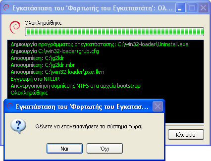
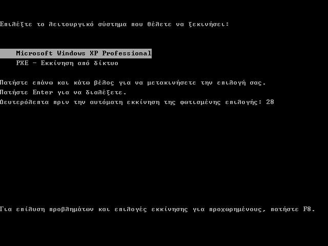
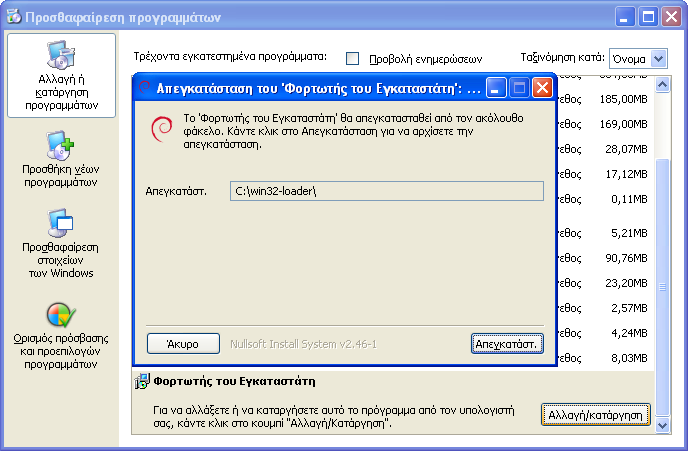

Στην περίπτωση που κάποιος LTSP client έχει εγκατεστημένα Windows,
μπορούμε να προσθέσουμε μια επιλογή ++"Εκκίνηση από το δίκτυο"++ στο αρχικό μενού εκκίνησης
(Windows Boot Manager), ώστε να επιλέγουμε εύκολα εάν θα γίνεται τοπική
ή δικτυακή εκκίνηση. Αυτό γίνεται με την εγκατάσταση της εφαρμογής
[win32-loader](https://en.wikipedia.org/wiki/Win32-loader), η οποία
αναπτύσσεται από το Debian για την εύκολη εγκατάστασή του σε
υπολογιστές με Windows.

## Βήματα εγκατάστασης

  - {: .right33}
    Κάντε [λήψη του win32-loader.exe](http://ftp.debian.org/debian/tools/win32-loader/stable/win32-loader.exe)
    και εκτελέστε το μέσα από τα Windows για να ξεκινήσει η εγκατάσταση.
  - Στο διάλογο ++"Επιλογής γλώσσας"++, διαλέξτε ++"Greek"++ .
  - {: .right33}
    Στο διάλογο ++"Επιλογής τύπου εγκατάστασης"++, διαλέξτε ++"Κατάσταση PXE: Εγκαταστήστε τον φορτωτή του PXE"++++" ώστε να φορτωθεί ο πυρήνας απομακρυσμένα"++.
  - Στο διάλογο ολοκλήρωσης της εγκατάστασης, πατήστε ++"Κλείσιμο"++.
  - {: .right33}
    Αγνοήστε το διάλογο που αναφέρει ότι θα πρέπει να επανεκκινήσετε τον
    υπολογιστή για να συνεχίσετε την εγκατάσταση. Το win32-loader
    χρησιμοποιείται και για απομακρυσμένες εγκαταστάσεις Debian,
    αλλά εμείς χρησιμοποιούμε μόνο την δυνατότητα εκκίνησης από το
    δίκτυο, οπότε δεν μας ενδιαφέρει. Πατήστε ++"ΟΚ"++.
  - Στο διάλογο ++"Επανεκκίνησης"++, επιλέξτε ++"Όχι"++.
  - {: .right33}
    Κάντε ++"δεξί κλικ"++ στο εικονίδιο ++"Ο Υπολογιστής μου"++ και επιλέξτε διαδοχικά
    ++"Ιδιότητες"++▸++"Για προχωρημένους"++▸++"Ρυθμίσεις (Εκκίνηση και αποκατάσταση)"++.
    Θα εμφανιστούν οι διάλογοι που φαίνονται δεξιά, από όπου μπορείτε να προσαρμόσετε την
    προεπιλεγμένη καταχώρηση και το χρόνο επιλογής της. Εάν
    χρειαστείτε περισσότερες πληροφορίες, ανατρέξτε στο
    [σχετικό άρθρο βοήθειας της Microsoft](http://support.microsoft.com/kb/289022).
  - {: .right33}
    Κατά την επόμενη **επανεκκίνηση**, ο boot manager των Windows θα
    εμφανίσει τις επιλογές που εμφανίζονται στην εικόνα δεξιά.

## Βήματα απεγκατάστασης

{: .right33}
Εάν για κάποιο λόγο θελήσετε να αφαιρέσετε τον win32-loader, μπορείτε να τον
καταργήσετε από την προσθαφαίρεση προγραμμάτων, όπως φαίνεται στη
διπλανή εικόνα.
