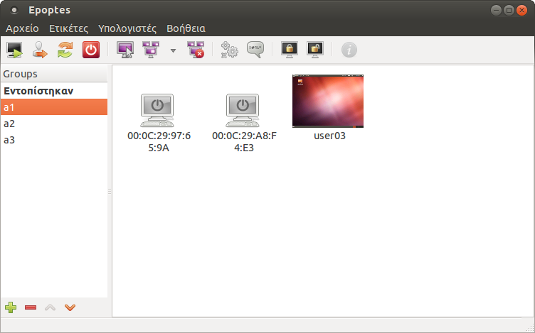

# Ομάδες

[](groups.png)Η εφαρμογή Επόπτης εντοπίζει και εμφανίζει
αυτόματα τους υπολογιστές του τοπικού δικτύου που έχουν ρυθμισμένη την υπηρεσία
`epoptes-client`.

Στην αριστερή στήλη ***Ομάδες*** του Επόπτη δημιουργείται αυτόματα η ομάδα
***Εντοπίστηκαν***. Από το εικονίδιο
 στο κάτω μέρος μπορείτε να
προσθέσετε κι άλλες ομάδες, οι οποίες αρχικά θα είναι άδειες. Στη συνέχεια
μπορείτε να σύρετε (μία-μία) μικρογραφίες από την ομάδα ***Εντοπίστηκαν*** σε
όποια άλλη ομάδα θέλετε, όπου και θα αποθηκευτούν μόνιμα.

Τα οφέλη της δημιουργίας ομάδων είναι:

- Αν υπάρχουν πολλά εργαστήρια, με τις ομάδες μπορούμε να τα ελέγχουμε χωριστά
  (π.χ. προβολή οθόνης).
- Μπορούμε να δούμε τους υπολογιστές ακόμα και όταν είναι offline, ώστε να
  κάνουμε Wake on LAN από το μενού ***Υπολογιστές*** ▸ ***Συνεδρία*** ▸
  ***Εκκίνηση***.
- Μπορούμε να ορίσουμε [ψευδώνυμα](#ψευδώνυμα) στους υπολογιστές.

## Ψευδώνυμα {#aliases}

[](offline-clients.png)Αφού δημιουργήσουμε μια ομάδα,
θα παρατηρήσουμε ότι οι offline clients φαίνονται γκρι και χρησιμοποιούν την
MAC address τους για όνομα. Για να τους δώσουμε ένα όνομα, κάνουμε ***δεξί
κλικ*** ▸ ***Πληροφορίες*** σε κάποιον  client και εμφανίζεται ο σχετικός
διάλογος. Πατώντας το κουμπί δεξιά από την ετικέτα ***Ψευδώνυμο υπολογιστή***
μπορούμε να ορίσουμε το όνομα με το οποίο θέλουμε να βλέπουμε τον υπολογιστή.

!!! warning ""
    Δεν είναι δυνατή η ανάθεση ψευδωνύμων όταν έχουμε επιλεγμένη την ομάδα
    ***Εντοπίστηκαν***.

## Καθολικές ομάδες {#global-groups}

Οι ομάδες στον Επόπτη αποθηκεύονται στο αρχείο `~/.config/epoptes/groups.json`,
το οποίο είναι διαφορετικό για κάθε καθηγητή. Όμως σε κάποιες περιπτώσεις είναι
βολικότερο οι ομάδες να οριστούν μόνο μία φορά από τον administrator, και να
ισχύουν καθολικά:

1. Συνδεθείτε ως ο χρήστης administrator και ορίστε τις ομάδες όπως τις
   θέλετε.
2. Κλείστε τον Επόπτη και εκτελέστε την παρακάτω εντολή στο τερματικό:
   ```shell
   sudo mv ~/.config/epoptes/groups.json /etc/epoptes/
   ```

Πλέον όλοι οι καθηγητές θα βλέπουν αυτές τις ομάδες. Εάν προσπαθήσουν να τις
αλλάξουν, οι αλλαγές δεν θα αποθηκευτούν. Ο ίδιος ο administrator μπορεί
οποιοαδήποτε στιγμή να προσαρμόσει τις ομάδες με τον γνωστό τρόπο χωρίς να
χρειάζεται να τρέξει ξανά αυτές τις εντολές. Το αρχείο
`/etc/epoptes/groups.json` θα ενημερώνεται κάθε φορά που ο administrator
κλείνει το παράθυρο του Επόπτη.
