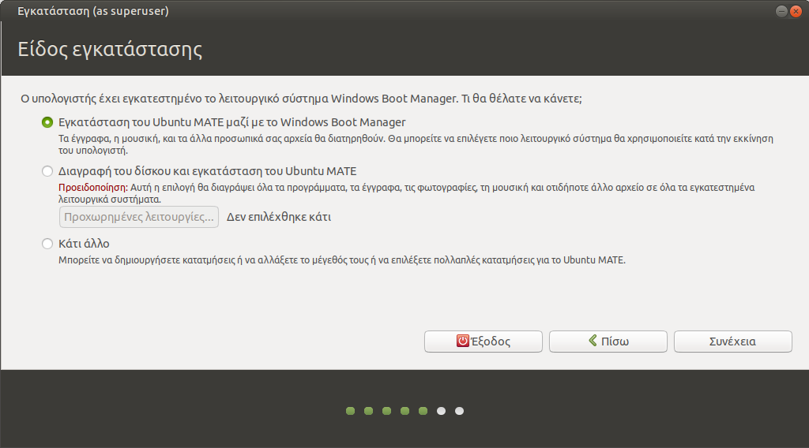

# Εγκατάσταση Ubuntu με προεγκατεστημένα UEFI Windows

Όταν έχουμε υπολογιστή με προεγκατεστημένα τα Windows 10 συνήθως αυτά είναι σε
UEFI mode. Σε αυτήν την περίπτωση, αν δε θέλουμε να διαγράψουμε τα Windows, θα
πρέπει και τα Ubuntu να εγκατασταθούν σε UEFI mode.

## Προϋποθέσεις

Για να γίνει όμως σωστά η όλη διαδικασία θα πρέπει να εξασφαλίσουμε δύο
σημαντικές προϋποθέσεις:

1.  To live USB stick που θα χρησιμοποιήσουμε για την εγκατάσταση του Ubuntu, να
    έχει bootάρει σε UEFI mode.

2.  Ότι τα Windows όντως είναι εγκατεστημένα σε UEFI mode.

## Βήματα

1.  [](Dell_OptiPlex_390_UEFI.jpg) Αφού
    προετοιμάσουμε το [live USB stick](../../ubuntu/liveusb/) και κάνουμε boot
    από αυτό, είναι πιθανό το USB stick να εμφανιστεί δύο φορές στον boot
    manager, για παράδειγμα:

    -   ***USB DISK 2.0 (7388MB)***: για εκκίνηση σε κατάσταση BIOS, και
    -   ***UEFI: USB DISK 2.0 (7388MB)***: για εκκίνηση σε κατάσταση UEFI.

    Επιλέγουμε το ***UEFI: USB DISK 2.0 (7388MB)***.

    Στη διπλανή εικόνα βλέπουμε ένα παράδειγμα από Dell OptiPlex 390.

2.  Στη συνέχεια ανάλογα πως έχει δημιουργηθεί το USB stick, θα πρέπει να
    εμφανιστεί μενού με τις επιλογές εκκίνησης ώστε να επιλέξετε το .iso που
    θέλετε.

    !!! tip "Χρήσιμο"
        -   Στην περίπτωση του [LiveUSB](../../ubuntu/liveusb.md#liveusb) θα
            εμφανιστεί μενού GNU GRUB στο οποίο θα πρέπει να υπάρχει και η
            επιλογή ***Enter UEFI setup***. Αν εμφανίζεται η επιλογή ***Boot
            DOS*** είστε σε BIOS mode, **επιστρέψτε στο 1ο βήμα**.
        -   Αν έχετε χρησιμοποιήσει το
            [Ventoy](../../ubuntu/liveusb.md#ventoy), στο μενού του κάτω
            αριστερά, θα υπάρχει η ένδειξη ***UEFI***. Αν εμφανίζεται
            ***BIOS***, **επιστρέψτε στο 1ο βήμα**.

2.  Από το live περιβάλλον του Ubuntu ελέγχουμε τις [δύο
    προϋποθέσεις](#προϋποθέσεις) με τις ακόλουθες εντολές:

    1.  Για να επιβεβαιώσουμε ότι το USB stick είναι σε UEFI mode,
        από [τερματικό](../../glossary#terminal):
        ```shell
        ls /sys/firmware/efi
        ```
        Αν ο κατάλογος υπάρχει, είμαστε σε κατάσταση **UEFI**.

    2.  Για να βεβαιωθούμε ότι Windows μας είναι εγκατεστημένα σε UEFI:
        ```shell
        sudo parted -l
        ```
        Αν το `Partition Table` είναι: `gpt`, τότε είναι σε **UEFI**, ενώ αν το
        `Partition Table` είναι: `msdos`, τότε είναι σε **BIOS**.

    !!! warning "Προσοχή"
        Αν η κατάσταση των Windows δεν ταιριάζει με την κατάσταση που μπούταρε
        το live Ubuntu, τότε δεν προχωράμε σε εγκατάσταση.

3.  [](type-of-installation.png)
    Ακολουθούμε τα βήματα [Εγκατάσταση του Ubuntu](../../ubuntu/installation/).
    Στο βήμα εγκατάστασης [Διατήρηση του περιβάλλοντος Microsoft
    Windows](../../ubuntu/disk-windows/#διατήρηση-του-περιβάλλοντος-microsoft-windows),
    στην περίπτωση των UEFI Windows, επιλέγουμε ***Εγκατάσταση του Ubuntu MATE
    μαζί με το Windows Boot Manager*** όπως φαίνεται στη διπλανή εικόνα.

## Υλοποιήσεις UEFI dual boot

### Lenovo ThinkCentre M91p

Οι οδηγίες εφαρμόστηκαν σε υπολογιστή **Lenovo ThinkCentre M91p** με
προεγκατεστημένα UEFI Windows 10. Μετά την ολοκλήρωση της εγκατάστασης, δεν
εμφανιζόταν ο GRUB και γινόταν απ' ευθείας boot στα Windows.

Διαπιστώθηκε ότι το UEFI στο συγκεκριμένο pc είναι προβληματικό. Αντί να
φορτώνει οποιοδήποτε UEFI λειτουργικό, δηλαδή το αρχείο
`\EFI\Boot\BOOTX64.EFI`, φόρτωνε μόνο Windows, δηλαδή το αρχείο
`\EFI\Microsoft\Boot\bootmgfw.efi`.

Για να παρακαμφθεί το πρόβλημα εφαρμόστηκε το ακόλουθο workaround. Αφού bootάρουμε με το live USB stick σε UEFI mode, από [τερματικό](../../glossary#terminal):
```shell-session
sudo -i
lsblk --fs
mount /dev/sda2 /mnt
cd /mnt/EFI/Microsoft/Boot/
mv bootmgfw.efi bootmgfw-real.efi
cp -a ../../ubuntu/grubx64.efi bootmgfw.efi
cd /
umount /mnt
mount /dev/sda5 /mnt
# Στα περιεχόμενα του grub.cfg, αλλαγή του bootmgfw.efi σε bootmgfw-real.efi
nano /mnt/boot/grub/grub.cfg
umount /mnt
sync;reboot
```
Επειδή όμως σε κάθε update-grub (kernel update) αυτή η αλλαγή ονόματος επανέρχεται σε `bootmgfw.efi`, θα πρέπει να τρέχουμε την εντολή:
```shell
sudo sed 's/bootmgfw.efi/bootmgfw-real.efi/g' -i /boot/grub/grub.cfg
```

