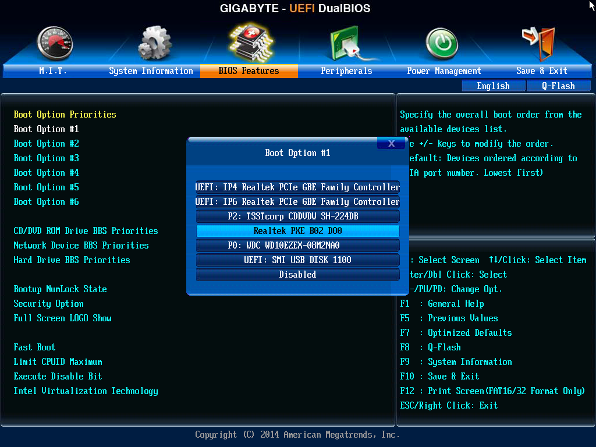
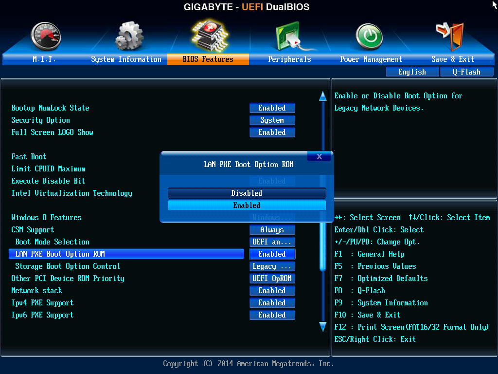

# Εκκίνηση από το δίκτυο

Για να εκκινήσετε τους σταθμούς εργασίας από το δίκτυο, υπάρχουν οι ακόλουθες
δυνατότητες. Επιλέξτε αυτή που ταιριάζει στο εργαστήριό σας.

## Υποστήριξη από το BIOS

Εάν οι κάρτες δικτύου των σταθμών εργασίας είναι ενσωματωμένες στη μητρική
πλακέτα (onboard) και όχι επιπρόσθετες σε PCI slot, κατά πάσα πιθανότητα θα
υποστηρίζουν εκκίνηση από το δίκτυο.

!!! tip "Συμβουλή"
    Κάθε εταιρία έχει το δικό της περιβάλλον ρύθμισης BIOS/UEFI οπότε οι
    παρακάτω οδηγίες μπορεί να μην αντιστοιχούν ακριβώς στο δικό σας. Εάν δεν
    καταφέρετε να τις εντοπίσετε, συμβουλευτείτε και τη σελίδα [Ρυθμίσεις
    δικτύου BIOS/UEFI](../guides/bios-uefi-netboot/index.md) στην οποία γίνεται
    προσπάθεια τεκμηρίωσης πολλών διαφορετικών BIOS/UEFI.

[](netboot-bios1.png)Επανεκκινήστε τον υπολογιστή,
πατήστε Del ή F12 κλπ για να μπείτε στο BIOS, και εντοπίστε την καρτέλα
ρύθμισης της σειράς εκκίνησης. Εκεί, θα πρέπει να υπάρχει τουλάχιστον η πρώτη
από τις ακόλουθες επιλογές:

-   Εκκίνηση από το δίκτυο (PXE ή LAN) σε κατάσταση BIOS. Στην εικόνα δεξιά
    αναφέρεται ως ***Realtek PXE B02 D00***, αλλά ανάλογα με το BIOS υπάρχουν
    διαφορετικές ονομασίες.
-   Εκκίνηση από το δίκτυο σε κατάσταση UEFI με IPv4. Στο BIOS της εικόνας
    αναφέρεται ως ***UEFI: IP4 Realtek PCIe GBE Family Controller***.

Επιλέξτε την πρώτη επιλογή αν ο δίσκος του υπολογιστή σας είναι φορμαρισμένος
σε κατάσταση BIOS/MBR, ή την δεύτερη αν είναι σε UEFI/GPT. Το LTSP υποστηρίζει
και τις δύο αυτές λειτουργίες, αλλά δεν υποστηρίζει το UEFI IPv6.

[](netboot-bios2.png)Εάν εντοπίσατε την καρτέλα ρύθμισης
της σειράς εκκίνησης, αλλά δεν βλέπετε επιλογή για την κάρτα δικτύου, τότε
προσπαθήστε να εντοπίσετε σε άλλο σημείο τις ακόλουθες ρυθμίσεις:

-   Ενεργοποίηση της κάρτας δικτύου (enable onboard LAN).
-   Ενεργοποίηση της Boot ROM της κάρτας δικτύου για κατάσταση BIOS. Στην
    εικόνα δεξιά αναφέρεται ως ***LAN PXE Boot Option ROM: Enabled***.
-   Ενεργοποίηση του IPv4 PXE για κατάσταση UEFI. Στην εικόνα αναφέρεται ως
    ***Ipv4 PXE Support: Enabled***.

Αποθηκεύστε τις ρυθμίσεις και βγείτε από το BIOS. Οι υπολογιστές θα εκκινούν
αυτόματα από το δίκτυο όταν εντοπίζουν έναν LTSP server.

!!! tip "Συμβουλή"
    Για να ξεκινήσετε τους σταθμούς εργασίας με το τοπικό λειτουργικό, μπορείτε
    είτε να πείτε στους μαθητές να πατήσουν Esc κατά την εκκίνηση, είτε να μην
    έχετε ξεκινήσει τον server σε Ubuntu, είτε προσωρινά να του αποσυνδέσετε το
    καλώδιο δικτύου.

## Χρήση του iPXE

Όταν το BIOS δεν υποστηρίζει εκκίνηση από το δίκτυο, χρησιμοποιούμε το
πρόγραμμα [iPXE](https://ipxe.org), το οποίο το εγκαθιστούμε με έναν από τους
παρακάτω τρόπους.

### Υπολογιστές με Windows

Εάν οι υπολογιστές έχουν εγκατεστημένα Windows >= 2000, τότε μπορείτε να
εγκαταστήσετε το πρόγραμμα [win32-loader](../guides/win32-loader/index.md),
το οποίο προσθέτει στον boot manager των Windows μία επιλογή για εκκίνηση από
το δίκτυο.

### Υπολογιστές με Ubuntu

Εάν οι σταθμοί εργασίας έχουν Ubuntu, τότε από [τερματικό](../glossary/index.md#terminal):
```
sudo -i
mkdir -p /etc/default/grub.d
wget https://gitlab.com/sch-scripts/sch-scripts/raw/main/share/sch-scripts/grub.cfg -O /etc/default/grub.d/sch-scripts.cfg
add-apt-repository --yes ppa:ts.sch.gr
apt update
apt install --yes grub-ipxe
```
έτσι ώστε:

-   να προστεθούν τα αποθετήρια της Τεχνικής Στήριξης.
-   να υπάρχει υποστήριξη για UEFI.
-   να γίνεται save default στον grub.

### Υπολογιστές με Debian

Εκτελέστε την εντολή `sudo apt-get install ipxe`, ώστε να εμφανιστεί στον grub
μία επιλογή για εκκίνηση από το δίκτυο.

### Εκκίνηση από CDROM

Εάν οι σταθμοί εργασίας δεν έχουν καθόλου σκληρό δίσκο, το πρόγραμμα εκκίνησης
από το δίκτυο μπορεί να εγκατασταθεί και σε δισκέτα ή CDROM. Για να
δημιουργήσετε ένα εκκινήσιμο CDROM, κατεβάστε το αρχείο
[ipxe.iso](http://boot.ipxe.org/ipxe.iso) και ανοίξτε το με το πρόγραμμα
εγγραφής CDROM του λειτουργικού σας συστήματος. Μην παραλείψετε να ρυθμίσετε το
BIOS των σταθμών εργασίας ώστε να ξεκινάνε πρώτα από το CDROM.

### Εκκίνηση από δισκέτα

Κατεβάστε το αρχείο [ipxe.dsk](http://boot.ipxe.org/ipxe.dsk) και γράψτε το σε
δισκέτα με έναν από τους παρακάτω τρόπους, ανάλογα με το λειτουργικό σύστημα
που χρησιμοποιείτε:

**Linux:**

```shell
dd if=ipxe.dsk of=/dev/fd0
```

**Windows:** Χρησιμοποιήστε το πρόγραμμα [Rufus](https://rufus.ie/).
