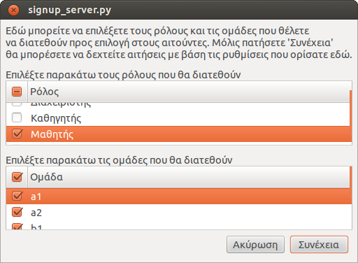
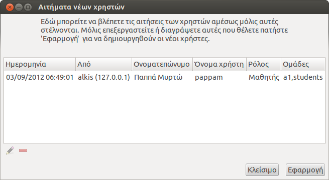

# Δημιουργία χρηστών

Βασικό κομμάτι της εφαρμογής αποτελεί η αυτοματοποίηση στη δημιουργία των
λογαριασμών των χρηστών. Υπάρχουν τρία βασικά μοντέλα δημιουργίας λογαριασμών
χρηστών τα οποία περιγράφονται στις παρακάτω παραγράφους.

## Ένας λογαριασμός ανά υπολογιστή

Μια μέθοδος είναι να έχουμε έναν λογαριασμό χρήστη ανά υπολογιστή, για
παράδειγμα να κάνουμε μαζική δημιουργία των χρηστών pc01, pc02, ..., pc12 από
το μενού ***Αρχείο*** ▸ ***Δημιουργία χρηστών ανά υπολογιστή*** της εφαρμογής
sch-scripts όπως φαίνεται στην εικόνα δεξιά. Συνηθίζεται επίσης να
ενεργοποιείται η [δυνατότητα αυτόματης
σύνδεσης](../../ltsp/Προχωρημένα/Αυτόματη_σύνδεση.md) ώστε να μην χρειάζεται οι
μαθητές να απομνημονεύσουν το κοινό username/password. Επίσης συνήθως
δημιουργούνται χειρωνακτικά υποφάκελοι στην επιφάνεια εργασίας ή στα Έγγραφα
για κάθε τμήμα, και βασιζόμαστε στην καλή θέληση των μαθητών να μην διαγράφουν
αρχεία άλλων ή να μην πειράζουν την ταπετσαρία ή τα μενού κτλ.

!!! tip "Συμβουλή"
    Γενικά αυτή η μέθοδος δεν προτείνεται για χρήση παρά μόνο ίσως σε Δημοτικά,
    συνήθως η επόμενη βολεύει καλύτερα.

## Ένας λογαριασμός ανά υπολογιστή και ανά τμήμα

Δημιουργώντας ξεχωριστό λογαριασμό ανά υπολογιστή και ανά τμήμα (π.χ. a1-01,
όπου το 01 αντιστοιχεί στο pc01) διασφαλίζετε ότι η κάθε ομάδα μαθητών που
εργάζεται σε έναν υπολογιστή θα έχει ξεχωριστά Έγγραφα και ρυθμίσεις από τις
άλλες ομάδες μαθητών άλλων τμημάτων που κάθονται στον ίδιο υπολογιστή. Έτσι,
μπορεί κάθε ομάδα μαθητών να προσαρμόσει την Επιφάνεια εργασίας όπως αυτή
επιθυμεί χωρίς να διατρέχει τον κίνδυνο απώλειας, ενώ παράλληλα διασφαλίζεται
και η προστασία των δεδομένων καθώς μια ομάδα δεν έχει πρόσβαση σε αρχεία άλλων
ομάδων.

Για να δημιουργήσετε μαθητικούς λογαριασμούς με αυτό το μοντέλο, μπορείτε να
χρησιμοποιήσετε την επιλογή ***Αρχείο*** ▸ ***Δημιουργία χρηστών ανά υπολογιστή***
(δεξιά εικόνα) της εφαρμογής sch-scripts. Μέσω της λειτουργίας αυτής μπορείτε
να δημιουργήσετε πολλούς λογαριασμούς χρηστών χρησιμοποιώντας ένα πρότυπο το
οποίο βέβαια μπορείτε να το επεξεργαστείτε όπως εσείς επιθυμείτε.

Πιο συγκεκριμένα από την ετικέτα ***Βασικές πληροφορίες*** με την επιλογή
***Τμήματα*** μπορείτε να ορίσετε τα ονόματα των τμημάτων για τα οποία θέλετε να
φτιάξετε λογαριασμούς, ενώ με την επιλογή ***Λογαριασμοί ανά τμήμα*** τον αριθμό
των υπολογιστών που έχει το εργαστήριο.

Στην επιλογές που υπάρχουν κάτω από την ετικέτα ***Πρότυπα λογαριασμών
(προαιρετικό)***, όπως έχουμε προαναφέρει μπορείτε να καθορίσετε τα ονόματα
χρηστών, τους κωδικούς πρόσβασης καθώς και τα πραγματικά ονόματα των χρηστών
που πρόκειται να παραχθούν. Η μορφή και το πλήθος των λογαριασμών
παρουσιάζονται στη λίστα που είναι κάτω από την ετικέτα ***Θα δημιουργηθούν οι
παρακάτω 72 λογαριασμοί***.

Στο παράδειγμά μας, ο διάλογος θα φτιάξει για κάθε τμήμα (a1, a2, b1, b2, c1,
c2) 12 λογαριασμούς. Στα πεδία ***Πρότυπο ονόματος χρήστη***, ***Πρότυπο
πραγματικού ονόματος*** και ***Πρότυπο κωδικού πρόσβασης*** το "i" συμβολίζει τον
αριθμό των λογαριασμών ενώ το "c" συμβολίζει τα τμήματα. Δηλαδή στο παράδειγμά
μας έχουμε επιλέξει 12 λογαριασμούς ανά τμήμα οπότε το "i" θα παίρνει τιμές από
το 01 έως το 12. Επίσης έχουμε πληκτρολογήσει την δημιουργία 6 τμημάτων οπότε
το "c" θα πάρει τις τιμές "a1", "a2", "b1", "b2", "c1" και "c2".

Π.χ για το τμήμα a1 έχουμε θα φτιαχτούν οι παρακάτω λογαριασμοί:

| Όνομα χρήστη | Πραγματικό όνομα | Κωδικός πρόσβασης | Τιμές για το i και το c |
| ------------ | ---------------- | ----------------- | ----------------------- |
| a1-01        | Χρήστης a1-01    | a1-01             | i=01 & c=a1             |
| a1-02        | Χρήστης a1-02    | a1-02             | i=02 & c=a1             |
| a1-03        | Χρήστης a1-03    | a1-03             | i=03 & c=a1             |
| a1-04        | Χρήστης a1-04    | a1-04             | i=04 & c=a1             |
| ...          | ...              | ...               | ...                     |
| a1-10        | Χρήστης a1-10    | a1-10             | i=10 & c=a1             |
| a1-11        | Χρήστης a1-11    | a1-11             | i=11 & c=a1             |
| a1-12        | Χρήστης a1-12    | a1-12             | i=12 & c=a1             |

!!! tip "Συμβουλή"
    Σημειώνουμε πώς στη λίστα θα εμφανίζονται μόνο οι 300 πρώτοι λογαριασμοί
    στην περίπτωση που πληκτρολογήσετε την δημιουργία παραπάνω χρηστών.

## Ξεχωριστός λογαριασμός ανά μαθητή

Σ' αυτήν την περίπτωση κάθε μαθητής έχει δικό του λογαριασμό της μορφής
`epwvumo_ovoma`, και τον διατηρεί για όλες τις τάξεις εφόσον μπαίνει στο ίδιο
εργαστήριο. Εάν ο κάθε μαθητής συμμετέχει σε πολλά τμήματα (γενικής παιδείας,
ξένων γλωσσών, κατεύθυνσης, projects...) τότε ίσως είναι η πιο ταιριαστή λύση.
Για να δημιουργήσετε μαθητικούς λογαριασμούς με αυτό το μοντέλο, μπορείτε να
χρησιμοποιήσετε τρεις διαφορετικές λειτουργίες της εφαρμογής sch-scripts οι
οποίες περιγράφονται στις επόμενες παραγράφους.

### Δημιουργία νέου χρήστη

 Τη συγκεκριμένη επιλογή μπορείτε να την
ενεργοποιήσετε από το μενού ***Χρήστες*** ▸ ***Νέος χρήστης*** των sch-scripts. Στα
δεξιά της οθόνης παρουσιάζουμε ενδεικτικά ένα παράδειγμα του διαλόγου. Σε αυτόν
μπορείτε να καθορίσετε τα στοιχεία του χρήστη όπως: Όνομα χρήστη, Κωδικό
πρόσβασης, UID, Αρχικό κατάλογο, κτλ.

!!! tip "Συμβουλή"
    Πληκτρολογώντας το όνομα χρήστη συμπληρώνεται αυτόματα και ο αρχικός
    κατάλογος του λογαριασμού, που είναι συνήθως της μορφής `/home/Όνομα
    χρήστη`.

    Το πεδίο UID (μοναδικό αναγνωριστικό κλειδί χρήστη) συμπληρώνετε αυτόματα
    κατά την έναρξη του διαλόγου. Καλό θα ήταν η προεπιλεγμένη αυτή τιμή να
    αφήνετε όπως έχει για την αποφυγή προβλημάτων. Η επεξεργασία του συνιστάται
    μόνο σε περιπτώσεις αναβαθμίσεων του λειτουργικού συστήματος. Παρακάτω
    δίνεται ένα παράδειγμα αυτής της περίπτωσης.

Έστω ότι θέλετε να κάνατε αναβάθμιση του λειτουργικού συστήματος Ubuntu από την
έκδοση 20.04 στην 22.04 διατηρώντας τον αρχικό κατάλογο (`/home/teacher`) του
χρήστη `teacher`. Ο χρήστης `teacher` στην έκδοση 10.04 υπήρχε με UID = 1234
και GID = 5678. Η δημιουργία ενός χρήστη `teacher` στην καινούρια έκδοση με τα
προεπιλεγμένα UID και GID θα εμφάνιζε πρόβλημα στο πεδίο ***Αρχικός κατάλογος***,
όπως αυτό φαίνεται και στην εικόνα δεξιά σας. Ο σχεδιασμός της εφαρμογής των
sch-scripts έχει γίνει με τέτοιο τρόπο ώστε να προβλέπει τέτοιου είδους
προβλήματα και να ειδοποιεί το χρήστη με κατάλληλο μήνυμα (tooltip). Ένα
επιπλέον χαρακτηριστικό της εφαρμογής με σκοπό την αποτελεσματικότερη και
ασφαλή λειτουργία της εφαρμογής είναι η απενεργοποίηση της επιλογής
***Εφαρμογή*** σε τέτοιου είδους καταστάσεις. Με τη αλλαγή του πεδίου ***UID*** από
την καρτέλα ***Πληροφορίες χρήστη*** καθώς και του πεδίου ***GID*** από την καρτέλα
***Επιλογές ομάδων*** με τι τιμές 1234 και 5678 αντίστοιχα, ο καινούριος χρήστης
θα μπορεί να δημιουργηθεί κανονικά και να συνδεθεί στο σύστημα χωρίς πρόβλημα.

!!! tip "Συμβουλή"
    Συνήθως, η επιλογή που προτείνεται σε περιπτώσεις αναβάθμισης του
    λειτουργικού συστήματος του εξυπηρετητή για την αποφυγή τέτοιου είδους
    προβλημάτων είναι η εισαγωγή χρηστών από csv αρχείο, η οποία θα αναλυθεί
    παρακάτω.

### Εισαγωγή χρηστών από csv αρχείο

Τέτοιου είδους αρχεία
μπορείτε να δημιουργήσετε είτε χρησιμοποιώντας το λογισμικό διαχείρισης
μαθητικού δυναμικού του σχολείου (Νέστωρας κτλ), είτε, εάν ανοίγετε email στο
ΠΣΔ για κάθε μαθητή, αντιγράφοντας τη λίστα μαθητών από τη σχετική σελίδα του
ΠΣΔ, είτε μέσω της εφαρμογής sch-scripts, πηγαίνοντας στο μενού ***Αρχείο*** ▸
***Εξαγωγή σε csv***.

Στα
δεξιά, φαίνονται ο διάλογος εξαγωγής χρηστών, η οθόνη εισαγωγής χρηστών από
αρχείο csv, και η πρώτη οθόνη του διαλόγου εισαγωγής χρηστών από αρχείο csv.

!!! tip "Συμβουλή"
    Επιλέγοντας συγκεκριμένους χρήστες, από την περιοχή εμφάνισης των
    λογαριασμών, πριν την εκτέλεση της ενέργειας ***Εξαγωγή σε csv*** θα έχει ως
    αποτέλεσμα την εξαγωγή μόνο των συγκεκριμένων χρηστών στο αρχείο. Στην
    περίπτωση που δεν έχετε επιλέξει κάποιο χρήστη, στο αρχείο θα εξαχθούν όλοι
    οι χρήστες της/των επιλεγμένων ομάδων.

Το LibreOffice μπορεί να βοηθήσει στη διαμόρφωση του αρχείου πριν την εισαγωγή
του στα sch-scripts.

Στην συνέχεια, μέσω της επιλογής ***Αρχείο*** ▸ ***Εισαγωγή από csv*** μπορείτε να
εισάγετε το αρχείο. Ο διάλογος που εμφανίζεται κατά την εισαγωγή του αρχείου
φαίνεται στα δεξιά σας. Σε αυτόν το διάλογο μπορείτε να επεξεργαστείτε τα
στοιχεία των λογαριασμών, να διαγράψετε λογαριασμούς που δεν επιθυμείτε να
εισαχθούν στο σύστημα και τέλος με την επιλογή ***Αυτόματη επίλυση προβλημάτων***
να επιλύσετε τυχόν συγκρούσεις που μπορούν να υπάρξουν ανάμεσα στα στοιχεία των
υπαρχόντων λογαριασμών και στα στοιχεία των λογαριασμών που εμφανίζονται στο
διάλογο.

Στην εικόνα δεξιά σας φαίνεται η πρώτη οθόνη του διάλογου αυτού. Επειδή,
μερικοί χρήστες που περιέχονται στο αρχείο υπάρχουν ήδη στο σύστημα, με ακριβώς
τα ίδια στοιχεία, η εφαρμογή προτείνει την διαγραφή τους από την λίστα με σκοπό
να μην πραγματοποιηθεί η εισαγωγή τους.

Στην περίπτωσή που πατήσετε ***Όχι***, τότε ο διάλογος θα έχει την μορφή που
φαίνεται στην εικόνα δεξιά σας. Οι χρήστες της λίστας, όπου έχουν στο πρώτο
κελί το εικονίδιο
,
εμφανίζουν κάποια σύγκρουση με τα στοιχεία των υπαρχόντων λογαριασμών στο
σύστημα. Τα πεδία με κόκκινο χρώμα είναι εκείνα τα πεδία που παρουσιάζουν τις
συγκρούσεις. Πηγαίνοντας με τον δείκτη του ποντικιού σας πάνω σε αυτά τα πεδία
εμφανίζεται ένα μήνυμα το όποιο σας αναφέρει το πρόβλημα. Κάνοντας κλικ στην
επιλογή ***Αυτόματη επίλυση προβλημάτων*** η εφαρμογή θα προσπαθήσει να δώσει
λύση στις συγκρούσεις αυτές.

!!! warning "Προσοχή"
    Σε μερικές περιπτώσεις η επιλογή ***Αυτόματη επίλυση λογαριασμών*** δεν
    μπορεί να λύσει όλες τις συγκρούσεις. Σε αυτή την περίπτωση θα πρέπει να
    επέμβετε στα πεδία που παρουσιάζουν τις συγκρούσεις και να τροποποιήσετε τα
    περιεχόμενα τους σύμφωνα με την υπόδειξη που θα σας εμφανίζεται όταν
    τοποθετήσετε τον δείκτη του ποντικιού σας πάνω τους (tooltip).

### Εισαγωγή χρηστών από το passwd αρχείο

Εναλλακτικός τρόπος εισαγωγής χρηστών δίνεται από την επιλογή ***Εισαγωγή από
passwd*** που βρίσκεται στο μενού ***Αρχείο*** ▸ ***Εισαγωγή από passwd*** της
εφαρμογής sch-scripts. Το αρχείο εισόδου αυτής της επιλογής είναι το αρχείο
passwd. Η συγκεκριμένη λειτουργία βοηθάει τη μεταφορά των λογαριασμών στην
περίπτωση αλλαγής του λειτουργικού συστήματος π.χ από Ubuntu 20.04 σε Ubuntu
22.04. Το μόνο που απαιτείται είναι η δημιουργία αντιγράφων ασφαλείας των
αρχείων passwd, shadow, group, τα οποία βρίσκονται στο κατάλογο /etc, από το
παλιό λειτουργικό σύστημα.

!!! warning "Προσοχή"
    Στον κατάλογο που βρίσκεται το αρχείου εισόδου passwd, πρέπει να βρίσκονται
    και τα αρχεία shadow και group, ώστε να γίνει σωστά η εισαγωγή των κωδικών
    πρόσβασης των λογαριασμών καθώς και η δημιουργία των ομάδων.

Μετά την εισαγωγή του αρχείου passwd, ο διάλογος που εμφανίζεται είναι
παρόμοιος με αυτόν της επιλογής ***Εισαγωγή από csv***.

### Αιτήσεις εγγραφών νέων χρηστών

 Τα sch-scripts περιλαμβάνουν
μια υπηρεσία ανάλογη με τη διαδικασία εγγραφής π.χ. σε ένα φόρουμ, όπου ο ίδιος
ο μαθητής καταχωρεί τα στοιχεία του σε μία φόρμα, και ο υπεύθυνος ΣΕΠΕΗΥ στη
συνέχεια εγκρίνει τη δημιουργία του λογαριασμού.

Για να ενεργοποιήσετε αυτήν την υπηρεσία, πηγαίνετε στο μενού ***Αρχείο*** ▸
***Ενεργοποίηση εγγραφών χρηστών*** των sch-scripts. Θα ανοίξει η φόρμα που
φαίνεται στα δεξιά της οθόνης.

 Επιλέξτε τους ρόλους και τις
ομάδες χρηστών για τις οποίες επιτρέπονται οι εγγραφές στην παρούσα φάση, για
παράδειγμα, στις 1-10 Σεπτεμβρίου μπορείτε να επιτρέψετε μόνο εγγραφές
καθηγητών και προσωπικού, ενώ μετά τις 10 Σεπτεμβρίου μόνο μαθητών. Πατώντας το
κουμπί ***Συνέχεια***, θα εμφανιστεί η φόρμα παραλαβής των αιτημάτων των χρηστών,
όπως φαίνεται δεξιά.

!!! tip "Συμβουλή"
    Οι αιτήσεις εγγραφής νέων χρηστών γίνονται αποδεκτές μόνο ενόσω αυτή η
    φόρμα είναι ανοιχτή.

 Στη συνέχεια, ανοίξτε τον Επόπτη,
επιλέξτε τους σταθμούς εργασίας στους οποίους θέλετε να εμφανίσετε τον διάλογο
εγγραφών, πατήστε το κουμπί ***Εκτέλεση*** της γραμμής εργαλείων, και δώστε την
εντολή: `sudo /usr/share/sch-scripts/signup`

Πείτε στους χρήστες να συμπληρώσουν τα στοιχεία τους, όπως φαίνεται στην εικόνα
στα δεξιά της οθόνης. Τέλος, επεξεργαστείτε ή επικυρώστε τη δημιουργία
λογαριασμών τους από τη φόρμα παραλαβής αιτημάτων που έχετε ανοιχτή στον
εξυπηρετητή.
