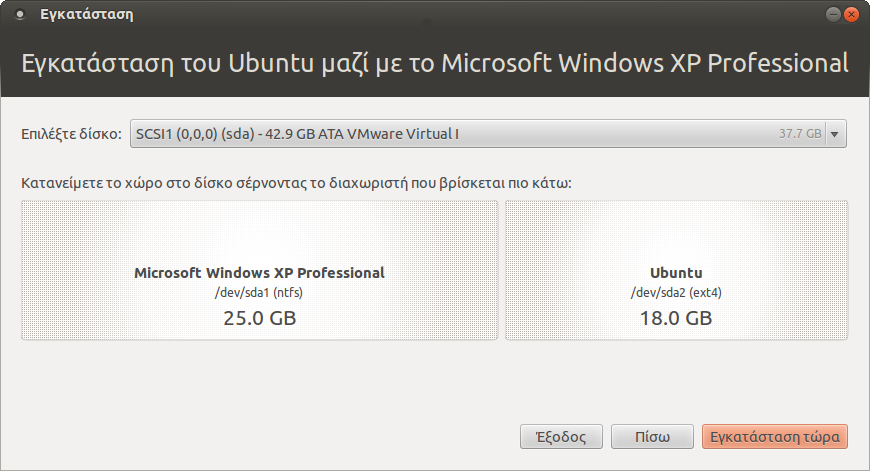
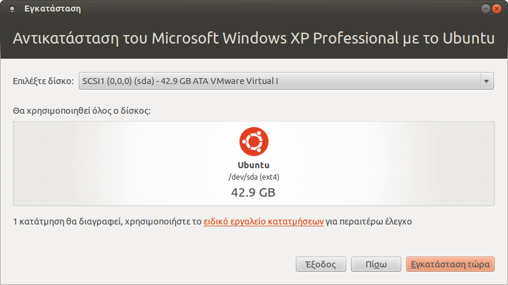

# Δίσκος με Windows

 Στην
περίπτωση που έχετε ήδη εγκατεστημένη κάποια έκδοση Microsoft Windows ο
διάλογος που θα σας εμφανιστεί σε αυτό το βήμα θα είναι παρόμοιος με αυτόν που
φαίνεται στην εικόνα δεξιά σας.

Ο διάλογος προτείνει τις εξής 3 περιπτώσεις:

- [Διατήρηση του περιβάλλοντος Microsoft
  Windows](#διατήρηση-του-περιβάλλοντος-microsoft-windows).
- [Διαγραφή του περιβάλλοντος Microsoft
  Windows](#διαγραφή-του-περιβάλλοντος-microsoft-windows).
- [Χειροκίνητη δημιουργία κατατμήσεων](#χειροκίνητη-δημιουργία-κατατμήσεων).

## Διατήρηση του περιβάλλοντος Microsoft Windows

Εάν θέλετε να εγκαταστήσετε το Ubuntu παράλληλα με τα Windows:

1. Επιλέξτε την πρώτη
   επιλογή και έπειτα πατήστε ***Συνέχεια***. Με αυτήν την επιλογή θα
   πραγματοποιηθεί σμίκρυνση στην κατάτμηση των Windows ώστε να προκύψει
   ελεύθερος χώρος στον οποίο θα εγκατασταθεί το Ubuntu.
2. Στον
   επόμενο διάλογο θα σας ζητηθεί να ορίσετε το μέγεθος των κατατμήσεων και για
   τα δύο λειτουργικά συστήματα. Αυτό μπορείτε να το κάνετε πηγαίνοντας το
   κέρσορα στο κενό που βρίσκεται ανάμεσα στις δύο κατατμήσεις και σέρνοντας το
   διαχωριστή είτε δεξιά είτε αριστερά όπως φαίνεται στην εικόνα δεξιά σας και
   επιλέξτε ***Εγκατάσταση τώρα***.
3. Τέλος, επιλέξτε ***Συνέχεια*** στον διάλογο που θα σας εμφανιστεί και θα σας
   ενημερώνει για το κίνδυνο αλλαγής των κατατμήσεων.

## Διαγραφή του περιβάλλοντος Microsoft Windows

Εάν επιθυμείτε να διαγράψετε το Windows και να εγκαταστήσετε το Ubuntu:

1. Επιλέξτε την
   δεύτερη επιλογή και έπειτα πατήστε ***Συνέχεια***.
2. Στον
   επόμενο διάλογο αρκεί να επιλέξτε ***Εγκατάσταση τώρα*** για να ξεκινήσει η
   εγκατάσταση.

## Χειροκίνητη δημιουργία κατατμήσεων

Τέλος, **εφόσον έχετε γνώσεις Linux** και επιθυμείτε κάτι άλλο, όπως για
παράδειγμα να ορίσετε μεγαλύτερο μέγεθος swap ή να δημιουργήσετε διαφορετικές
κατατμήσεις για τους καταλόγους του Ubuntu:

1. Επιλέξτε την τρίτη επιλογή ***Κάτι άλλο*** για να πραγματοποιήσετε
   χειροκίνητη δημιουργία των κατατμήσεων όπως επιθυμείτε.
