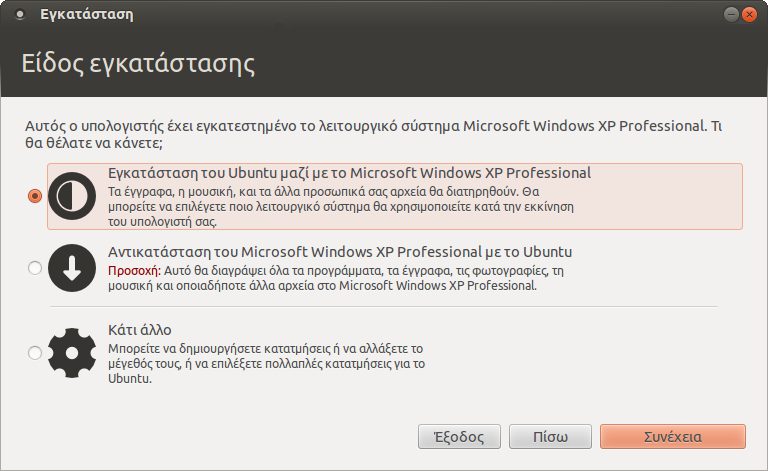

{ align=right width=300 }
Στην περίπτωση που έχετε ήδη εγκατεστημένη κάποια έκδοση MS-Windows ο
διάλογος που θα σας εμφανιστεί σε αυτό το βήμα θα είναι παρόμοιος με
αυτό που φαίνεται στην εικόνα δεξιά σας.

Ο διάλογος προτείνει τις εξής 3 περιπτώσεις:

  - Διατήρηση του περιβάλλοντος MS-Windows.
  - Διαγραφή του περιβάλλοντος MS-Windows.
  - Χειροκίνητη δημιουργία κατατμήσεων.

## Διατήρηση του περιβάλλοντος MS-Windows

{ align=right width=300 }
Εάν θέλετε να εγκαταστήσετε το Ubuntu παράλληλα με το Windows:

1.  Επιλέξτε την πρώτη επιλογή

    { align=right width=300 }
    και έπειτα . Με αυτήν την επιλογή θα πραγματοποιηθεί σμίκρυνση στην
    κατάτμηση των Windows ώστε να προκύψει ελεύθερος χώρος στον οποίο
    θα εγκατασταθεί το Ubuntu.
2.  Στον επόμενο διάλογο θα σας ζητηθεί να ορίσετε το μέγεθος των
    κατατμήσεων και για τα δύο λειτουργικά συστήματα. Αυτό
    μπορείτε να το κάνετε πηγαίνοντας το κέρσορα στο κενό που
    βρίσκεται ανάμεσα στις δύο κατατμήσεις και σέρνοντας το
    διαχωριστή είτε δεξιά είτε αριστερά όπως φαίνεται στην
    εικόνα δεξιά σας και επιλέξτε .
3.  Τέλος, επιλέξτε  στο διάλογο που θα σας εμφανιστεί και θα σας
    ενημερώνει για το κίνδυνο αλλαγής των κατατμήσεων.

## Διαγραφή του περιβάλλοντος MS-Windows

{ align=right width=300 }
Εάν επιθυμείτε να διαγράψετε το Windows και να εγκαταστήσετε το Ubuntu:

1.  Επιλέξτε την δεύτερη επιλογή

    { align=right width=300 }
    και έπειτα .
2.  Στον επόμενο διάλογο αρκεί να επιλέξτε  για να ξεκινήσει η
    εγκατάσταση.

## Χειροκίνητη δημιουργία κατατμήσεων

Τέλος, **εφόσον έχετε γνώσεις Linux**, και επιθυμείτε κάτι άλλο (πχ: να
ορίσετε μεγαλύτερο μέγεθος swap ή να δημιουργήσετε διαφορετικές
κατατμήσεις για τους καταλόγους του Ubuntu κ.τ.λ.):

1.  Επιλέξτε την τρίτη επιλογή  για να πραγματοποιήσετε χειροκίνητη
    δημιουργία των κατατμήσεων όπως επιθυμείτε.
