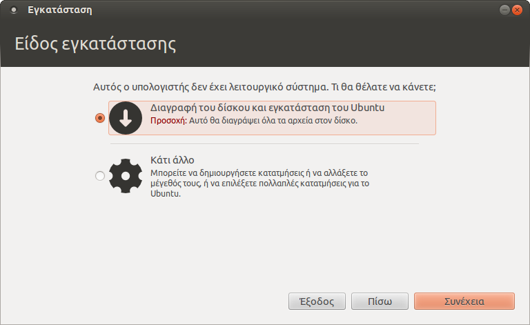
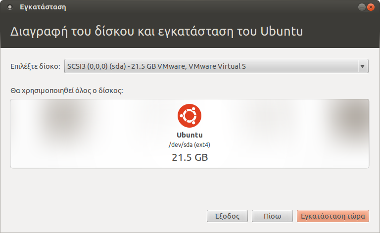

{ align=right width=300 }
Στην περίπτωση που δεν υπάρχει κάποιο λειτουργικό σύστημα εγκατεστημένο
στο υπολογιστή σας, ο διάλογος που θα σας εμφανιστεί σε αυτό το βήμα θα
είναι παρόμοιος με αυτό που φαίνεται στην εικόνα δεξιά σας.

Ο διάλογος προτείνει τις εξής 2 περιπτώσεις:

  - Εγκατάσταση του Ubuntu σε ολόκληρο το δίσκο.
  - Χειροκίνητη δημιουργία κατατμήσεων.

## Εγκατάσταση του Ubuntu σε ολόκληρο το δίσκο

{ align=right width=300 }
Εάν θέλετε να εγκαταστήσετε το Ubuntu σε ολόκληρο το δίσκο:

1.  Επιλέξτε την πρώτη επιλογή

    { align=right width=300 }
    και έπειτα . Με αυτή την επιλογή θα δημιουργηθεί μια κατάτμηση με
    μέγεθος ίσο με το μέγεθος του δίσκου στην οποία θα εγκατασταθεί
    το Ubuntu.
2.  Στον επόμενο διάλογο αρκεί να επιλέξετε  για να ξεκινήσει η
    εγκατάσταση.

## Χειροκίνητη δημιουργία κατατμήσεων

Τέλος, **εφόσον έχετε γνώσεις Linux**, και επιθυμείτε κάτι άλλο (πχ: να
ορίσετε μεγαλύτερο μέγεθος swap ή να δημιουργήσετε διαφορετικές
κατατμήσεις για τους καταλόγους του Ubuntu κ.τ.λ.):

1.  Επιλέξτε την δεύτερη επιλογή  για να πραγματοποιήσετε χειροκίνητη
    δημιουργία των κατατμήσεων όπως επιθυμείτε.
